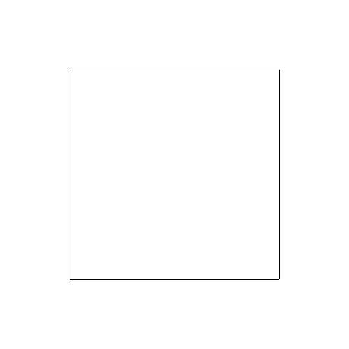
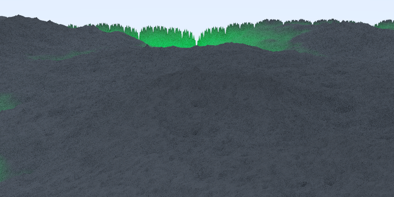
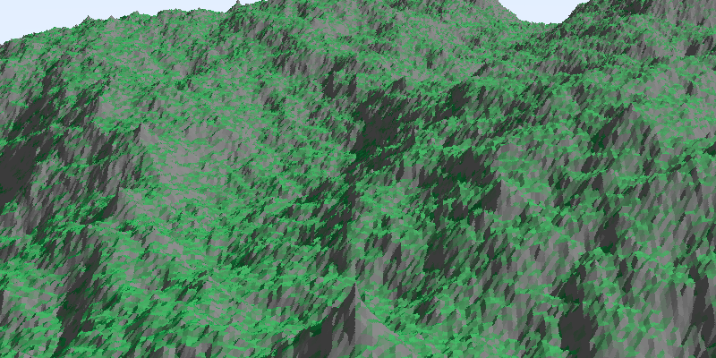
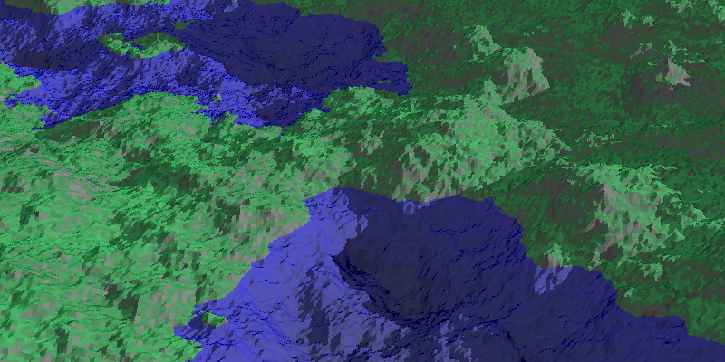
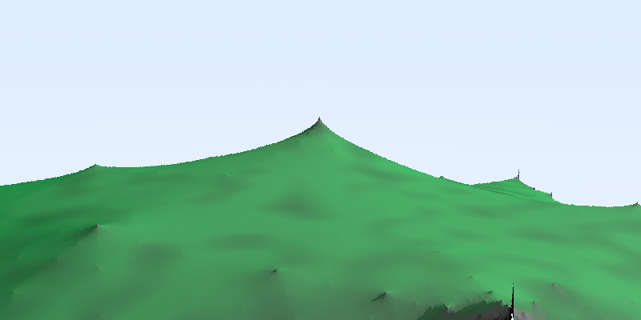
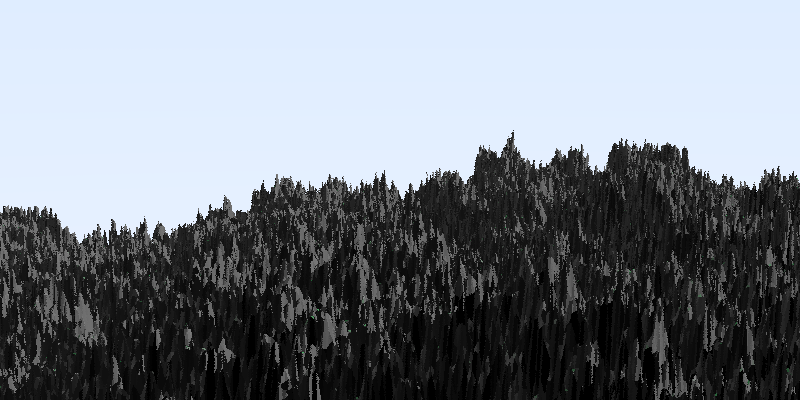
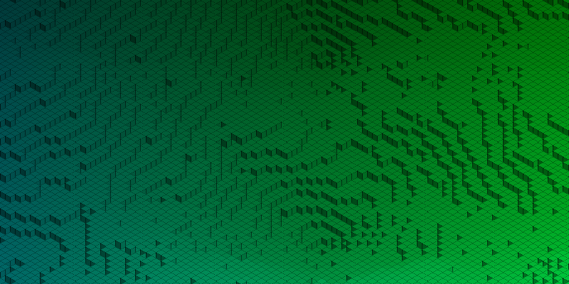

# Midpoint Displacement

[Weekly Programming Challenge #16](http://weblog.jamisbuck.org/2016/11/12/weekly-programming-challenge-16.html)

## Normal mode (1, 2, 3)

## Hard mode (1)

## Hard mode (2)

## Hard mode (3)

TODO

## Hard mode (4)

TODO

## Hard mode (5)

Already implemented

## Hard mode (6)

It seems like finding parameters that produce a nice image
is harder than implementing the algorithm

Phong shading looks much better, but sadly the raytracer is not efficient enough
to render images where the exponent is higher...

Maybe some hacky water will do the trick

It turned out that my implementation of the roughness parameter was not optimal,
here are some images generated with the fixed version (using `0.2`, `0.5` and `0.8` as roughness)

BONUS: A blocky isometric rendering of the terrain

